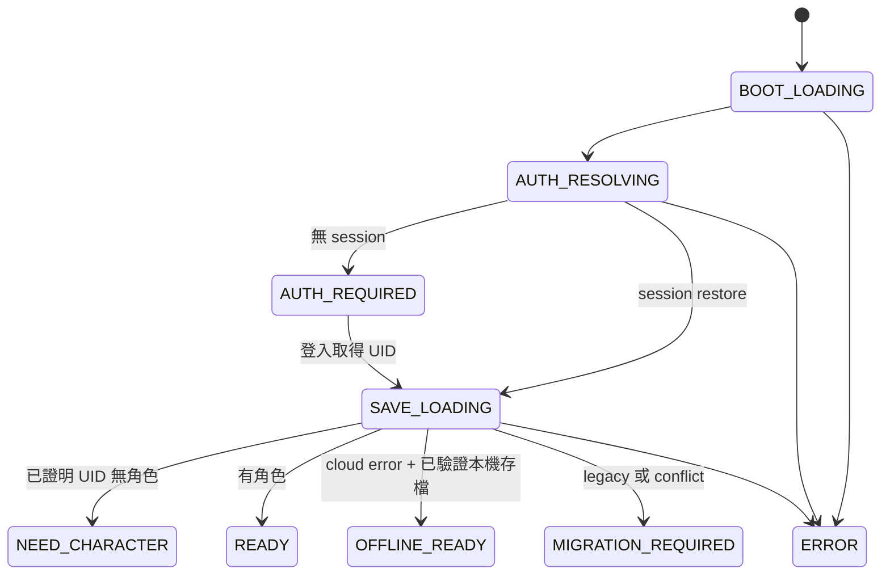

# 《四象江湖傳》Boot Architecture

本文件是啟動、帳號、存檔歸屬、feature loading 與 production asset 的正式規格。若歷史 HANDOFF 或舊版註解仍描述「完整 runtime gate」、「先本機遊玩」或 12～15 秒 cinematic，均以本文件與目前 source owner 為準。

## 唯一 owner

| 責任 | 正式 owner |
| --- | --- |
| 狀態與合法轉移 | `js/startup/startup-contract.js` |
| 啟動流程與畫面 destination | `js/52-v173.20-startup-loader.js` |
| Critical / Feature runtime 載入 | `js/startup/feature-loader.js`、`asset-manifest.json` |
| Feature source 邊界 | `config/feature-manifest.json`、`scripts/build-production.mjs` |
| UID 本機存檔與 migration | `js/startup/account-save-repository.js` |
| Gameplay save serialization | `js/00-main.js` 的 `FourSymbolsGameSave`／`saveGame()`／`loadGame()` |
| Firebase identity | `js/firebase/firebase-auth.js` |
| 帳號 UI | `js/firebase/firebase-auth-ui.js` |
| 客服聯絡資料與共用顯示視窗 | `js/startup/support-contact.js` |
| 可見頁面 Screen Wake Lock 生命週期 | `js/startup/screen-wake-lock-runtime.js` |
| 手機 background save／resume-discard diagnostics | `js/00-main.js` 的 `FourSymbolsMobileLifecycleDiagnostics` |
| 主城 First Screen 隊伍／秘寶摘要 shell | `js/16-stage-v54-main-city-runtime.js` + `js/relic-summary-catalog.js` |
| 雲端 read／trusted callable | `js/firebase/firebase-cloud-save.js` |
| Firebase lifecycle | `js/firebase/firebase-bootstrap.js` |
| 功能意圖、局部 loading、idle preload | `js/20-anonymous-20.js` |
| 正式版本檢查、跑馬燈與共用更新視窗協調 | `js/release-update-notification.js` + `release/release-update.json` |
| 巡怪圖片 | `js/26-v131-patrol-appearance.js` 與 `assets/characters/patrol/*.webp` |

不得新增另一個 startup owner、全域 runtime gate、帳號 bypass loader 或 `*-fix-loading.js` 類後置 patch。

## Startup State Machine

狀態語意：

| 狀態 | 可以顯示／操作的內容 | 禁止事項 |
| --- | --- | --- |
| `BOOT_LOADING` | Logo 與最小 boot shell | Gameplay、創角 |
| `AUTH_RESOLVING` | 真實 Auth 初始化進度 | 把錯誤當未登入或新玩家 |
| `AUTH_REQUIRED` | Google、Email 登入、建立 Email 帳號、Firebase 訪客 | 無 UID 創角、local-only bypass |
| `SAVE_LOADING` | 此 UID 的雲端／本機解析狀態 | 創角、跨 UID hydrate |
| `MIGRATION_REQUIRED` | 明確 migration／conflict 訊息與確認 | 自動綁定、silent overwrite |
| `NEED_CHARACTER` | 第一角色創建 | 在 Auth/Save 未完成時顯示 |
| `READY` | 已驗證角色與第一個可操作畫面 | 等待整套 gameplay runtime |
| `OFFLINE_READY` | 已驗證 UID namespace 的完整本機角色 | 無本機 ownership 時離線創角 |
| `ERROR` | 可理解的錯誤與 retry/account UI | fail-open、清除或覆寫存檔 |

`FourSymbolsStartupPolicy.canCreateCharacter()` 必須同時確認：state 是 `NEED_CHARACTER`、Firebase user UID、resolved UID、active local UID 三者相同，且 save resolution 已完成。創角頁本身不是決策者。

## Account-first 流程

1. Boot Core 載入 Firebase lifecycle。
2. Firebase Auth restore session；未登入時停在 `AUTH_REQUIRED`。
3. Google／Email／Anonymous Auth 成功後取得 UID。
4. 啟用該 UID 的 local repository，並行下載 app shell 與讀取 local/cloud save。
5. 只有同 UID authenticated cloud read 成功回報 document 不存在，或可信 same-UID metadata 明確表示空帳號，且 local/legacy 均安全，才進 `NEED_CHARACTER`。
6. 有 authoritative cloud character 或同 UID local character 時 hydrate 並進 `READY`。
7. Auth 或 save error 不可走「無角色」分支。

訪客不是離線 bypass。`訪客開始遊戲` 固定呼叫 Firebase Anonymous Auth，先取得匿名 UID，再解析該 UID 的存檔。

帳號 UI 在 `app-shell` 與 1080×1920 stage scaler 尚未載入前就必須可操作，因此固定掛在 `document.body`，以實際 browser viewport、`100dvh` 與 safe-area inset 自適應；不得再掛入 `#game-stage` 或依賴登入後才存在的縮放 runtime。登入頁與遊戲內系統頁的「聯絡客服」皆呼叫 Critical Boot 的 `FourSymbolsSupport`，客服信箱唯一來源為 `js/startup/support-contact.js`。

## Save ownership

Gameplay payload 保留既有 schema；ownership 不塞入戰鬥或數值欄位。

| 資料 | Key |
| --- | --- |
| Canonical account save | `four_symbols_save:{uid}` |
| Ownership metadata | `four_symbols_save_meta:{uid}` |
| Active UID pointer | `four_symbols_active_uid` |
| Account sidecar | `four_symbols_account:{uid}:{suffix}` |
| 未綁定 legacy | `battle_full_version_save_v5` |
| Migration backup | `four_symbols_legacy_backup:{uid}:{timestamp}` |

讀取時 canonical payload 與 metadata 必須同時存在，且 `metadata.ownerUid` 必須等於要求的 UID；缺一、損壞或 owner mismatch 一律 fail closed。寫入只允許目前 active UID。UID 變更或登出會先 deactivate，再完整 reload，避免 player、inventory、equipment、progress 等 module globals 殘留。

## Legacy migration

`battle_full_version_save_v5` 永遠不會因某次登入而自動歸屬該 UID。

1. 檢查 legacy JSON 是否可解析；損壞時進 `ERROR`，不得創角。
2. 使用者登入並完成 cloud read。
3. 顯示「偵測到此裝置存在舊版角色資料」。
4. 只有使用者明確確認、該 UID 尚無 local save、cloud 也沒有角色時才可 migration。
5. 先建立 timestamped 原文備份，再寫 account namespace；原 legacy key 保留。
6. Sidecar 逐項備份後才遷移；任何失敗會移除本次不完整 account write，但保留 legacy 與備份。
7. Cloud 已有角色且 local 沒有相同的已驗證 cloud-base fingerprint 時進 blocked conflict，不自動選邊、不覆寫；同 UID local 只有在 cloud 基底未變時才可作為該 snapshot 的本機後代續玩。

正式 cloud write 仍只允許 trusted backend。瀏覽器不得直接 create/update/delete Firestore authoritative progression。

## Critical Boot manifest

`asset-manifest.json` 是部署時的實際清單。未登入的 Critical Boot 只包含：

- 一個 hashed `boot-core.*.js`：客服聯絡 owner、非阻塞 Screen Wake Lock 生命週期、account repository、feature loader、startup contract、state machine。
- 一個 hashed `boot-core.*.css`：viewport/base、startup、account UI 與創角必要樣式。
- hashed startup logo。
- 五個 hashed Firebase lifecycle modules，加上 Firebase 官方 SDK 的必要 ESM dependency。
- `index.html` 的 shell、account UI host、必要錯誤顯示與 navigation DOM。

取得 UID 後，`app-shell` 與 UID save I/O 並行。主城第一畫面的 `#v146HomeRoster` 必須由 app-shell 先建立固定尺寸 shell；存檔 hydrate 前使用固定佔位，hydrate 後只填入三名角色與 `teamLoadout.relicId` 對應摘要，不得等待任何秘寶 feature 才新增整塊區域。秘寶名稱／觸發描述的 First Screen-safe 靜態來源固定為 `js/relic-summary-catalog.js`。Team Relic Battle Runtime 獨立為 lazy `feature-relic-runtime`；只有準備進入正式 Battle feature 時才作為 dependency execute。Boss／Tower／秘寶養成仍留在 `feature-boss-relic`，不得把整包塞回 Critical Boot。

取得 UID 後，`app-shell` 與 UID save I/O 並行。`app-shell` 是創角或已有角色進第一個可操作畫面的必要 legacy core；`gameplay-core` 與其餘 feature 不得阻塞 Auth UI、創角或主城互動。

正式版本通知屬於 `app-shell` 的非阻塞 runtime：只在 `four-symbols:startup-ready` 後開始背景檢查，不能延後 Auth、存檔解析、創角或 READY。它重用既有 `#homeFeatureModal`，在 native `#game-overlay-layer` 放置可點擊但不覆蓋全畫面的通知列；詳見 `SYSTEM_CONTRACTS.md`。首次檢查失敗、離線、timeout 或 manifest 損壞都只能安靜失敗並等待下一次節流檢查。

Loading progress 以已完成 task 為準：boot shell、account UI、Auth SDK、Auth state、save resolution、initial destination。100% 表示當前 destination 已可操作；唯一離場延遲是 360ms fade，不存在 cinematic minimum 或 90→100 計時補值。

## Three-level visual loading contract (2026-09-20)

`Runtime Ready ≠ Visual Ready`。Level 1 First Screen Required 由 `prepareFirstScreenVisuals()` 收集主城 live ``、computed CSS background、必要字型並 decode、等待兩次 paint；startup loader 只有在 `four-symbols:main-city-visual-ready` 後才能隱藏，失敗沿用正式 Retry。Level 2 Background Prefetch 在主城可操作後由唯一 Feature Loader 使用 idle queue、concurrency 1 低優先準備 common UI、Relic CSS／bundle 與 20 張 icon，不 execute Boss／Tower／Battle runtime；失敗不影響主城。Level 3 On-Demand Lazy Load 保留大型玩法按需載入，前景請求可取消未開始的背景工作並提升同一請求 priority。

秘寶首次開啟先顯示局部 loading，等 runtime、CSS、唯一 `RELIC_CATALOG_LIST[].iconPath`、字型與 live paint 完成後才一次顯示完整頁面。

## Feature manifest

| Bundle | 玩家功能 | Dependency |
| --- | --- | --- |
| `app-shell` | 主城 shell、創角、基本導航、既有核心資料 | 無 |
| `gameplay-core` | 戰鬥共用、背包、裝備、商店、合成、主要副本 runtime | `app-shell` |
| `feature-patrol` | 巡怪形象與 hashed WebP | `gameplay-core` |
| `feature-abyss` | 深淵兩層流程 | `gameplay-core` |
| `feature-relic-runtime` | Team Relic Catalog／Trigger／Effect／Battle VFX Runtime | `gameplay-core` |
| `feature-boss-relic` | 玩法中心、BOSS、四象塔、秘寶養成；Battle Runtime 由 `feature-relic-runtime` 提供 | `feature-relic-runtime` |

`pointerdown`／`touchstart` 只 prefetch 被指向的 feature；click 時若尚未 ready，只把該 control 標為 `aria-busy` 並顯示局部 loading。其他按鈕與全 app 保持可操作。Critical Ready 後由 `requestIdleCallback`（或 800ms fallback）只預抓高機率 bundle；preload 不等於 execute。

同一 dependency graph 的 CSS 與 script preload 先並行開始；JavaScript 再依拓撲與 bundle 內 source list 固定執行。禁止用 `script.onload → next network request` 維持 30 個歷史 patch 的順序。

## Patrol asset

舊 61 個 `v131-patrol-sprite-*.js`／`v131-patrol-sprite-male-*.js` 已移除。巡怪使用 16 個 content-hashed WebP，透過一般 URL、HTTP cache 與 `Image` decode；不再有 Base64 JS、字串拼接或 Canvas crop。圖片只有在 `feature-patrol` 真正執行並套用角色形象時才請求，不列入 Critical Boot。

## Production build 與 cache

執行 `node scripts/build-production.mjs` 產生 deterministic bundles、`asset-manifest.json` 與 hashed filenames；`--check` 只驗證，不改檔。source array 的順序就是 legacy execution contract，調整前必須先驗證 wrapper/override dependency。

- `/`、`index.html` 與 `asset-manifest.json`：要求每次重新驗證（設定為 `no-cache, no-store, must-revalidate`；Cloudflare 若正規化為語意等價的 `max-age=0, must-revalidate` 亦可接受，但絕不可為 `immutable`）。
- `release/release-update.json`：玩家正式版本資料，必須 `no-cache, no-store, must-revalidate`；runtime 同時加 timestamp query 與 `cache: no-store`。GitHub Pages 即使無法套用 `_headers`，也不得讓此檔走長期快取。
- 正式版本通知的 DEV 視覺驗收不另建 mock UI：只在 `dev.four-symbols-dev.pages.dev` 或本機精確 host 使用 `?releaseUpdatePreview=marquee`／`?releaseUpdatePreview=modal`，仍由同一 app-shell runtime 非阻塞讀取正式 manifest。該 preview 不寫已讀資料、不 reload，正式 main host 必須忽略。
- `build/*`、hashed patrol WebP、hashed startup logo：`max-age=31536000, immutable`。
- Cache invalidation 只靠內容 hash；`V_ASSET_VERSION` 不再讓未變更 bundle 全部失效。
- 不使用 Service Worker。若未來導入，必須另有 versioned cache、activation、cleanup、rollback 與跨版本測試。
- Cloudflare dev 由 `_headers` 套用上述 header；GitHub Pages 無法由 repository 自訂相同 response headers，但 hashed filename 仍可避免 stale content。

## Error strategy

- Auth 初始化／restore 失敗：`ERROR`，不可顯示創角。
- Authenticated Firestore read 成功且同 UID document 不存在：視為已證明空帳號；不需要用 client 或 callable write 才能進創角。
- Firestore read 失敗：只有同 UID、metadata 完整的 local save 可進 `OFFLINE_READY`；否則 `ERROR`。
- Cloud metadata 宣稱 ready 但 payload 缺失：`ERROR`。
- local JSON、metadata 或 ownership 損壞：`ERROR`，保留原資料。
- local/cloud/legacy conflict：`MIGRATION_REQUIRED` blocked，禁止 silent overwrite。
- Feature 載入失敗：只發出 `four-symbols:feature-local-error`，不得重新鎖住全域。

## Performance budgets 與 observability

## Mobile lifecycle 與 Screen Wake Lock

- `js/startup/screen-wake-lock-runtime.js` 是唯一 Wake Lock owner。visible／pageshow 只在未持鎖時取得；hidden／pagehide 會釋放並取消 retry。系統主動 release 且頁面仍 visible 時重新取得；request 失敗只允許有限節流 retry，不能阻塞 Startup。開發診斷由 `FourSymbolsScreenWakeLock.getDiagnostics()` 讀取。
- Android／Chrome freeze 或 discard 不能由網頁禁止。`js/00-main.js` 在 visibility hidden、pagehide、freeze 做既有正式 save，並用 `document.wasDiscarded`、Navigation Timing type、pageshow persisted、resume/freeze 計數提供 `FourSymbolsMobileLifecycleDiagnostics`。
- 普通 resume／pageshow 不得重跑 account-first Startup。真正 reload／discard 後重建仍由 Firebase Auth → UID save resolution → hydrate 的既有 StartupStateMachine 恢復；sessionStorage 只可省略同分頁已看過的長啟動呈現，不得成為權威進度來源，也不得覆蓋 Cloud Save。

永久 marks：`four-symbols:boot-core-ready`、`auth-initialized`、`auth-resolved`、`save-resolved`、`critical-ready`、`auth-ui-interactive`、`character-creation-interactive`、`main-city-data-ready`、`main-city-visual-ready`、`main-city-interactive`、`background-prefetch-start`、`background-prefetch-idle`、`relic-prefetch-ready`、`relic-runtime-ready`、`relic-visual-ready`。

| Budget | Gate |
| --- | --- |
| Artificial minimum / fake progress / global input gate | 0 |
| Direct critical local JS/CSS | 1 / 1 |
| Signed-out local critical source bytes | ≤ 650 KB（未壓縮上限） |
| Boot JavaScript source | ≤ 45 KB |
| Boot CSS source | ≤ 250 KB |
| Controlled cold auth UI | ≤ 5 s |
| Controlled warm existing-user city | ≤ 3 s CI hard ceiling；產品目標 ≤ 2 s |

`tests/boot-architecture.test.js`、`auth-before-character-creation.test.js`、`account-save-ownership.test.js`、`feature-loader-runtime.test.js`、`critical-feature-budget.test.js` 與 `.github/scripts/run-boot-architecture-browser-qa.mjs` 是永久 gate。部署後另由 `boot-live-browser-qa.mjs` 記錄實際 CDN/Firebase cold auth 數據；超過 5 秒必須報告實值與瓶頸，不得竄改或宣稱達標。

## Two-scene boot presentation (2026-09-11)

- Critical Boot preloads `assets/ui/startup-logo.4631c0bc3f2b.jpg` then `assets/ui/startup-main-city.d43e67af1c1c.jpg`.
- Scene 1 uses configurable `#startupLoader[data-logo-target-ms]` (default 900 ms). This timer only advances presentation; it is never awaited and never delays Firebase/Auth/save readiness.
- Scene 2 remains the signed-out Firebase account background. Firebase bootstrap/session restore continue concurrently; non-critical gameplay features remain lazy.
